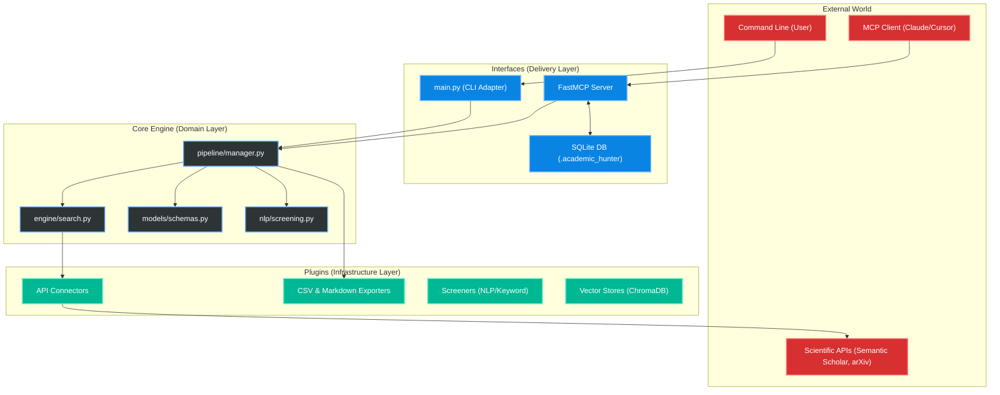

# Architecture of Academic Hunter

Academic Hunter is designed using **Hexagonal Architecture** (also known as Ports and Adapters). This ensures that the core domain logic (the scientific research engine) is strictly isolated from delivery mechanisms like the CLI or the MCP Server.

## High-Level System Diagram

## Directory Structure Explained

1. **`src/academic_hunter/core/`**: The brain of the project. Contains the business logic for deduplication, relevance scoring, and the search pipeline. It has zero knowledge of MCP or CLI.
2. **`src/academic_hunter/plugins/`**: Adapters for external services.
    - `connectors/` (APIs like Semantic Scholar)
    - `exporters/` (Markdown/CSV)
    - `screeners/` (NLP Semantic Evaluators)
    - `vector_stores/` (RAG / ChromaDB Storage)
3. **`src/academic_hunter/interfaces/`**: The entry points. 
    - `interfaces/mcp/` exposes the Core as an MCP Server using FastMCP. 
    - (Future) `interfaces/cli/` or `interfaces/api/` can be added here.
4. **`docs/superpowers/agents/`**: Contains the Multi-Agent prompts (`01_orchestrator.md`, `02_hunter.md`, `03_synthesizer.md`) meant to be used by LLMs connecting via MCP.
