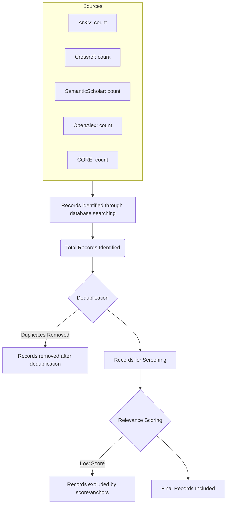

# Design Spec: Automated PRISMA Report Generation

## 1. Goal
Implement automated generation of a PRISMA (Preferred Reporting Items for Systematic Reviews and Meta-Analyses) report in Markdown format, including a Mermaid diagram to visualize the filtering flow.

## 2. Approach
- Add `generate_prisma_report(self, timestamp: str)` method to `AcademicHunter`.
- Use the existing `self.stats` dictionary to populate the report.
- The Mermaid diagram will use `graph TD` to show the step-by-step reduction of records.
- Integrate the report generation into `export_results`.

## 3. PRISMA Flow Steps
1. **Identification**: Records identified from each database (ArXiv, Crossref, etc.).
2. **Screening (Deduplication)**: Records removed as duplicates.
3. **Eligibility (Scoring)**: Records excluded because they didn't meet the minimum relevance score or anchor matches.
4. **Included**: Final number of records included in the dataset.

## 4. Mermaid Diagram Template

## 5. Implementation Plan
1. **Modify `src/academic_hunter.py`**:
    - Implement `generate_prisma_report`.
    - Update `export_results` to call it.
2. **Update `tests/test_rigor.py`**:
    - Add `test_prisma_report_generation` to verify file creation and content.
3. **Verification**:
    - Run tests.
    - Manually check the generated file.

## 6. Self-Review
- **Placeholder scan**: None.
- **Internal consistency**: Mermaid diagram logic matches the `self.stats` structure.
- **Scope check**: Focused on PRISMA report as requested.
- **Ambiguity check**: The term "Excluídos por score" covers both anchor mismatch (score 0) and low technical score.
